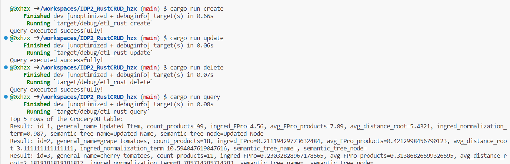
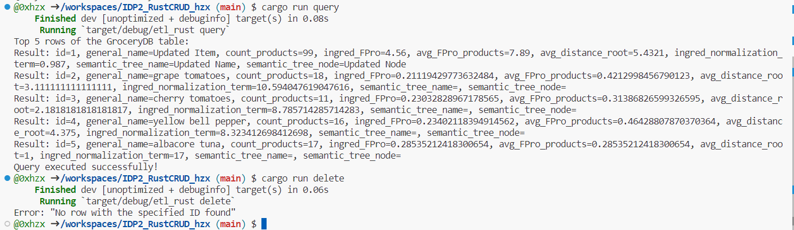
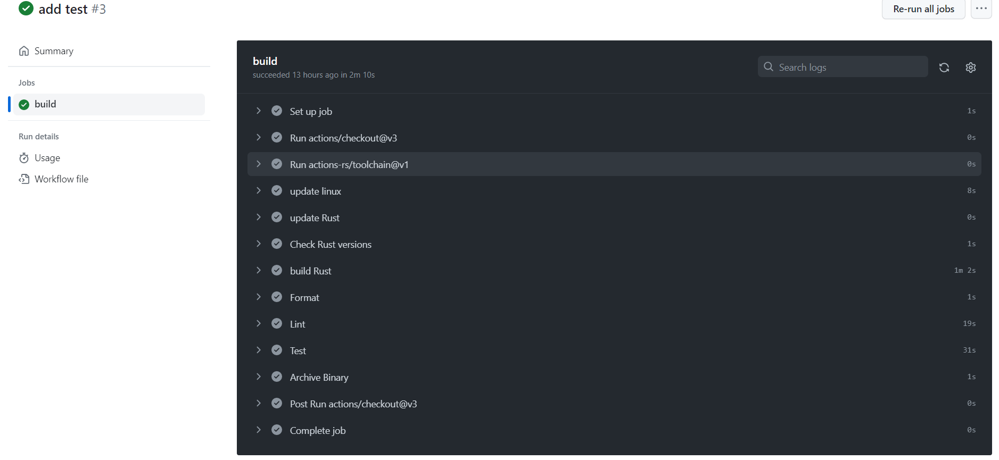

[](https://github.com/nogibjj/IDP2_RustCRUD_hzx/actions/workflows/cicd.yml)
# Rust CLI Binary with SQLite

## Demo Video
[Youtube Link](https://youtu.be/w8AJo-IJ3EA)


## Rust Source Code
###  Rust features, syntax and error handling
- **Pattern Matching**: Use match expressions to match command-line arguments and execute different code blocks based on the match result.
- **References and Borrowing**: When calling the functions such as `create_general_item` and `delete_general_item`, I make use of references and borrowing to avoid copying all the arguments onto the stack.
- **Type feature**: In the Rust code, when we see a return type like Result<(), String>, it means that the function can return either a success result (with no value) or a failure result (with an error message in the form of a String). For example,
```Rust
fn some_operation() -> Result<(), String> {
    // operation success：
    Ok(())

    // operation error：
    // Err("Error".to_string())
}

fn main() {
    match some_operation() {
        Ok(()) => {
            println!("Success");
        }
        Err(err) => {
            eprintln!("Error：{}", err);
        }
    }
}
```

- **? operator**: In Rust, the `?` operator is used for error handling with the `Result` type. It allows you to simplify error propagation and reduce the need for explicit error handling using match or unwrap. When ? is used, it's typically in a function that returns a Result, and if an error occurs, it automatically returns the error from the current function. When using the ? operator in Rust, the return value depends on whether the operation is successful (resulting in Ok) or encounters an error (resulting in Err).

## SQLite Database
Demonstrates CRUD operations on the SQLite database. The code is in `lib.rs` to operate the SQLite Database. And the CLI support actions inlcuding `extract`, `transform_load`, `create`, `delete`, `update` or `query`(Read) command.


If you delete the row with specific ID which does not exist. It will fail and give the error feedback.


## Use of GitHub Copilot
### Explanation of the project
This Rust CLI project is designed to perform various CRUD operations on a SQLite dataset, which is related to data extraction, transformation, and database management. Here's an overview of what each part of the code does:

1. **Command Line Argument Parsing:**
   - The program starts by collecting command-line arguments provided by the user using `env::args()`. It checks whether there are enough arguments (at least 2) to determine the action to be performed.

2. **Action Selection:**
   - Based on the action specified as the second argument, the program selects a particular operation. The available actions are:
     - "extract": Download and extract data from a URL into a local file.
     - "transform_load": Transform the extracted CSV data and load it into a database.
     - "query": Execute a query(Read) on the database.
     - "create": Create a new database entry.
     - "delete": Delete a database entry.
     - "update": Update an existing database entry.

3. **Action Execution:**
   - For each action, there's a corresponding function call. For example:
     - When "extract" is selected, it calls the `extract` function to download and save data.
     - When "transform_load" is selected, it calls the `transform_load` function to load data into a database.
     - When "query" is selected, it executes a query on the database.
     - When "create" is selected, it creates a new entry in the database.
     - When "delete" is selected, it deletes an entry from the database.
     - When "update" is selected, it updates an existing entry in the database.

4. **Error Handling:**
   - The code includes error handling to deal with potential errors during these operations. If any error occurs, it prints an error message with additional information.

5. **Usage Instructions:**
   - If the user provides incorrect or incomplete input, the program prints usage instructions to guide the user on how to use the commands properly.

### How to run the program
1. Open codespaces.
2. Build: run `cargo build` for dependencies installation.
3. Extract and transformation: run `cargo run extract` and `cargo run transform_load` in order to get the sqlite database.
4. Execute: run `cargo run <command>` to execute specific operation(`create`, `delete`, `update` or `query`).

### Dependencies 
All dependencies are in `Cargo.toml`. After saving the `Cargo.toml` file, Cargo will automatically download and manage dependencies based on your configuration.

## Optimized Rust Binary
In `.workflows/cicd.yml` you can assign the path of Rust Binary as a GitHub Actions artifact.
``` yml
name: Rust Binary
      uses: actions/upload-artifact@v2
      with:
        name: optimized-binary
        path: target/release/etl_rust
```

## GitHub Actions
Include testing, linting, formatting and building.


## References

* [rust-cli-template](https://github.com/kbknapp/rust-cli-template)
